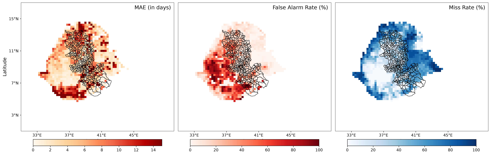
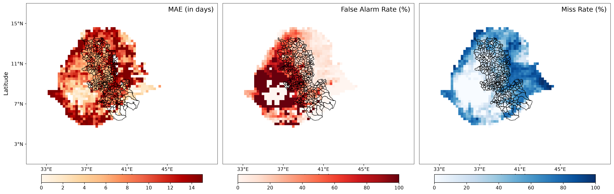
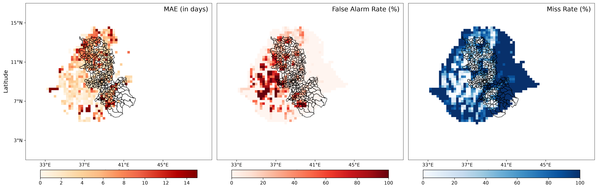
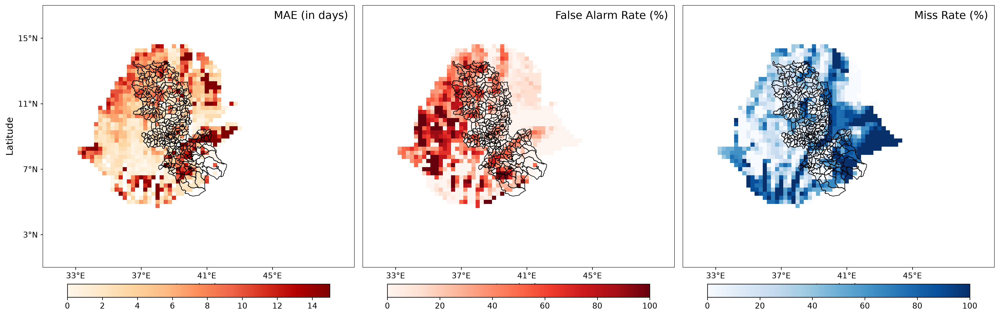
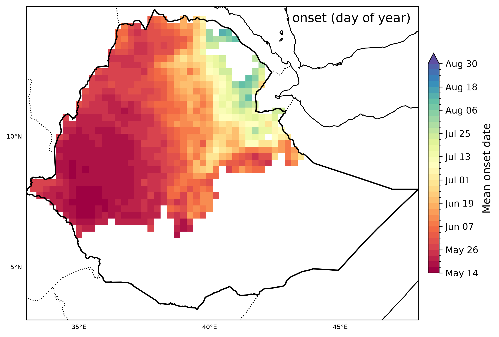
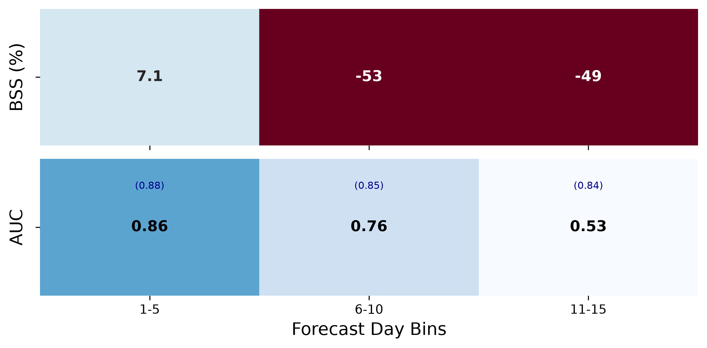
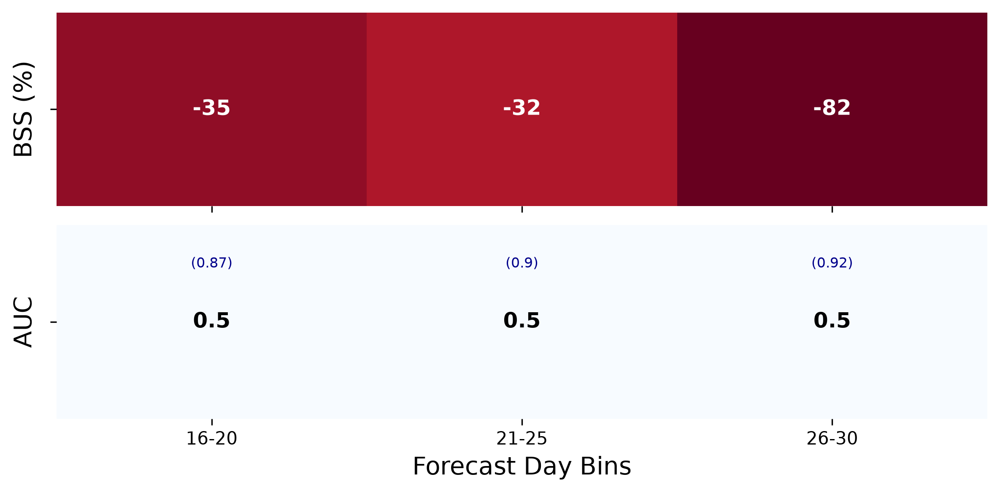
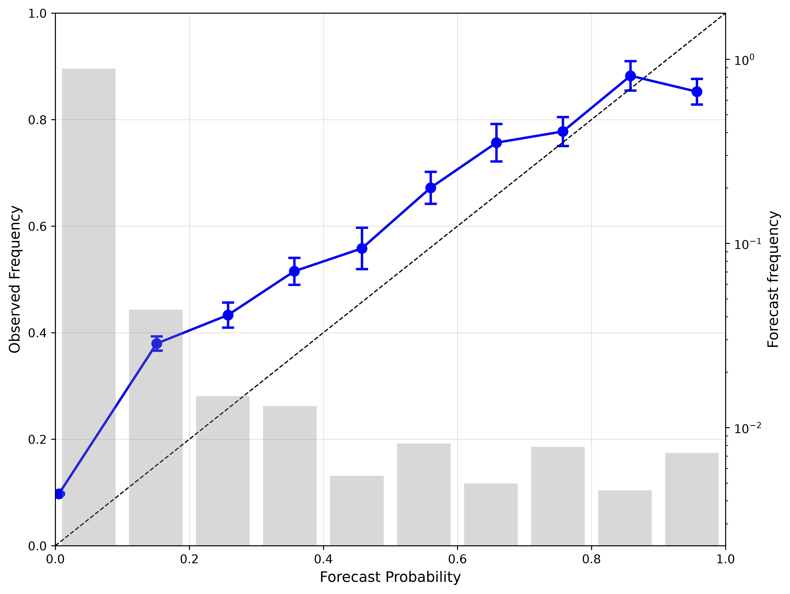
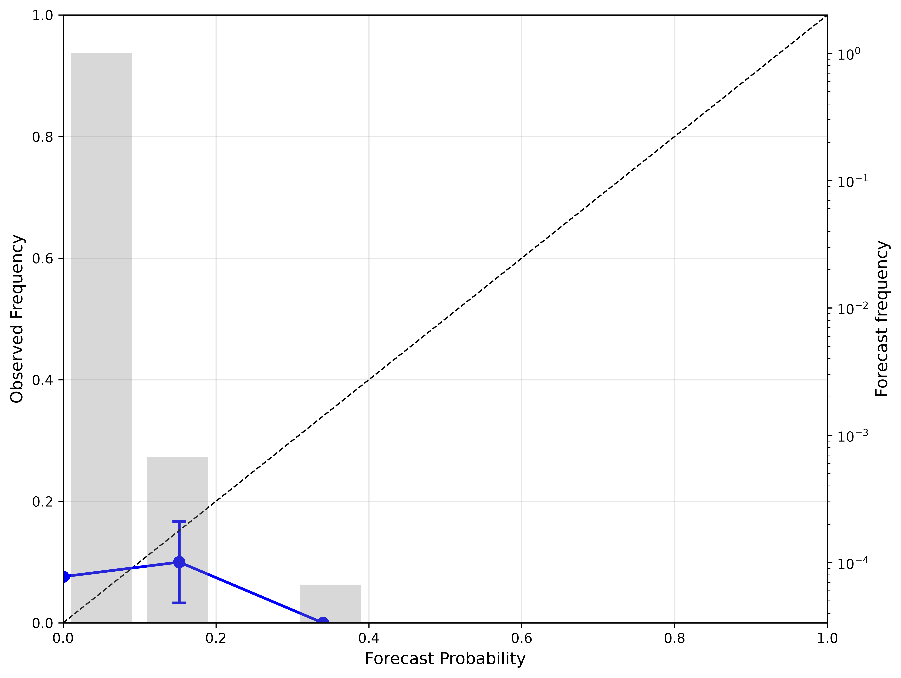

<!-- MathJax -->
<script type="text/javascript" src="https://cdnjs.cloudflare.com/ajax/libs/mathjax/2.7.3/MathJax.js?config=TeX-AMS-MML_HTMLorMML"></script>

# The AI Weather Model Scorecard

This lesson documents the complete ROMP (Rainy season Onset Metrics Package) / MOMP benchmarking workflow. It is used to evaluate AI weather forecast models (AIFS, FuXi, GraphCast, GenCast, AIFS-ENS) against observational rainfall data (e.g., CHIRPS, ENACTS) for rainy season onset in Ethiopia's Kiremt season, and it is designed to transfer to other regions and seasons.

> #### Prerequisites
> 
> - Complete the environment setup in [Demo 1: Setting Up AI Weather Forecasting Lab](/01-setup) before proceeding.
> - ROMP must be installed (`uv pip install pyproject.toml`). See [Demo 1, Section 7](/01-setup#7-rompmomp-benchmarking-configuration).
> - Familiarity with the Demo 3 Streamlit interface and NetCDF output format.
{: .prereq}

## Learning Objectives

By the end of this lesson, you will be able to:

- Explain the motivation for the package and the four dimensions it compares: location, wet-spell threshold, dry-spell threshold and lead time.
- Describe how onset is detected and why the same rules must be applied to observations and forecasts.
- Configure and execute deterministic benchmarks (MAE, FAR, Miss Rate).
- Configure and execute probabilistic benchmarks (Brier Score, Ranked Probability Score, AUC, Reliability).
- Interpret skill scores, spatial maps, reliability diagrams and composite plots against climatology.
- Explain what calibration (IDR) can and cannot fix.
- Diagnose and resolve common configuration, data, and pipeline errors.

## Lesson Roadmap

| Section | Purpose |
| --- | --- |
| Why Onset Matters | The user need and the definition of onset |
| The ROMP Benchmarking Package | Motivation, capabilities, workflow and configuration |
| Core Concepts for Benchmarking | Vocabulary needed to interpret any result |
| Benchmarking Metrics | Deterministic and probabilistic metrics and skill scores |
| Models and Evaluation Setup | What is compared, over which windows |
| Running ROMP Benchmarks | Command-line execution and output structure |
| Deterministic Evaluation | Worked example with maps and skill vs. climatology |
| Probabilistic Evaluation | Worked example with skill scores and reliability |
| Calibration with IDR | Diagnosing and improving probabilities |
| Composite Metric Plots | Summarising many results at once |
| Preliminary Model Results | Reference results to replicate and investigate |
| Best Practices and Troubleshooting | Making benchmarks defensible and fixing failures |
| Exercises and AI Almanac Activity | Hands-on practice and feedback |

## Why Onset Matters

In Ethiopian agriculture, the onset of the rainy season (Kiremt: June–September) dictates planting dates for millions of smallholder farmers. A late or false onset signal can lead to crop failure from planting too early, lost growing days from planting too late, and regional food insecurity.

Onset is not read directly from raw model output. To ensure genuine comparability, it is derived identically from daily rainfall data for observations, the reference model, and every forecast model using the following rules:

- **Wet-spell trigger**: A candidate onset day requires at least `wet_init` mm of initial rainfall, followed by `wet_spell` consecutive days with ≥ `wet_threshold` mm/day.
- **Dry-spell veto**: A candidate onset is invalidated if a dry spell (`dry_spell` consecutive days below `dry_threshold` mm/day) occurs within a `dry_extent`-day window afterward. This rejects false starts.
- **Application**: These rules are applied per grid cell, per year, within a defined search window (`start_date` to `end_date`).

## The ROMP Benchmarking Package

### Motivation for a Benchmarking Package

- **Demand**: model developers and forecasters both want a reproducible, quantitative workflow for routinely evaluating model performance on onset.
- **Region- and threshold-agnostic**: the package is not tied to Ethiopia. It can be applied to Kiremt rains and to other regions, and used with any model you choose.
- **Goal functionality**: compare models across location (grid cell, region or country), wet-spell thresholds, dry-spell thresholds, and lead times.

### Design Capabilities

We want your feedback, in person and online, to improve this package.

| Capability | What it means in practice |
| --- | --- |
| Metrics-based evaluation | Assumptions are objective, explicit and controllable. |
| Multi-model reforecasts | Several models are evaluated in one run against the same reference. |
| Multiple verification sources | Observations can come from different datasets (e.g. CHIRPS, ENACTS). |
| Custom onset definition | Wet-spell and dry-spell rules are user parameters. |
| Region-agnostic detection | The same detection code runs for any domain and season window. |
| Lead-time evaluation | Skill is reported per verification window and per lead-time bin. |
| Configuration-driven experiments | Each run is fully described by its config file, so results can be reproduced. |

### ROMP Workflow

```
config file  ->  load observations + model reforecasts
             ->  apply the SAME onset definition to both
             ->  match forecast onset to observed onset (per grid cell, per year, per init date)
             ->  compute metrics (DET or PROB track)
             ->  skill scores vs. climatology (or a named reference model)
             ->  maps, tables, heatmaps and reliability diagrams
```

### ROMP Specifications

#### 1. Onset definition (set in the config)

| Parameter | Meaning |
| --- | --- |
| `wet_init` | Minimum initial rainfall (mm) that starts a candidate onset |
| `wet_spell`, `wet_threshold` | Number of consecutive wet days, and the mm/day that counts as wet |
| `dry_spell`, `dry_threshold` | Length of a dry spell, and the mm/day below which a day is dry |
| `dry_extent` | Window (days) after the candidate in which a dry spell vetoes the onset |
| `start_date`, `end_date` | Search window for the season (e.g. Kiremt, June–September) |

#### 2. Data and domain

- Observations or reference rainfall: CHIRPS, ENACTS or another gridded product.
- Forecasts: daily rainfall from each model's reforecasts, on a common grid (e.g. 0.25°).
- A seasonal mask (e.g. `jjas_seasonal_mask_0p25.nc`) restricts evaluation to the grid points where a rainy season occurs.
- Models are registered centrally in `BENCHMARK_MODEL_CATALOG`.

#### 3. Verification set-up

- Verification windows: Days 1–15 and Days 16–30 after initialization.
- Matching tolerance: 3 days (Days 1–15) and 5 days (Days 16–30).
- Reference for skill scores: climatology by default, or a named model.
- Run mode: `DET` or `PROB`, chosen in the config or overridden on the command line (`--mode prob`). Never both in the same run.

## Core Concepts for Benchmarking

These ideas underpin every table and map in the lesson. Make sure they are clear before interpreting results.

### Forecasts, Reforecasts and Lead Time

A reforecast (hindcast) is a forecast re-run for past dates with a fixed model version. Benchmarking uses reforecasts because they provide many years of forecasts with a consistent system, which is the only way to estimate skill for a seasonal event such as onset.

An initialization date is when the forecast starts. Lead time is the number of days after initialization. Onset skill depends strongly on lead time and on how close the initialization is to the climatological onset date.

Verification is therefore organised by lead-time windows: Days 1–15 and Days 16–30 for deterministic models, and 5-day bins within those windows for probabilistic models.

### Verification Data

Observed onset is derived from a gridded rainfall product (e.g., CHIRPS, ENACTS). This product is the "truth" in the benchmark, but it has its own errors, so conclusions can change with the dataset.

Model and observations must be on a common grid and calendar. Very coarse grids are noisier to score but smoother to predict (see Preliminary Model Results).

### Events, Tolerance and Contingency Counts

Onset is a binary event per grid cell and year (did the season start within the search window?) with a timing attached (which day).

A matching tolerance decides how close in time a forecast onset must be to count as a hit. Tolerance is a scientific choice that trades strictness against usability, and it is longer at longer lead time.

Counts of hits, false alarms, misses and correct negatives are the basis for FAR and MR. MAE is computed only where both onsets exist, so it can look good when a model rarely predicts onset. Always read it with MR.

### Ensembles and Probabilities

An ensemble is a set of forecasts (members) from slightly different initial conditions or noise. The forecast probability of onset in a bin is the fraction of members that produce onset in that bin.

With a finite number of members, probabilities are noisy, so fair scores adjust for ensemble size.

Three separate qualities of a probabilistic forecast are measured:

| Quality | Question | Metric |
| --- | --- | --- |
| Accuracy | How close are the probabilities to what happened? | BS, RPS (and skill scores) |
| Discrimination | Can the forecast separate event from non-event cases? | AUC |
| Reliability | Do stated probabilities match observed frequencies? | Reliability diagram |

A forecast can discriminate well and still be unreliable. Reliability can be corrected by calibration. Discrimination cannot.

### Reference Forecasts and Skill

A model is only useful if it beats a reference that needs no model. The default reference is climatology, the distribution of onset dates over past years.

Skill scores are relative to that reference. They change if the reference period or dataset changes, so always document them.

### Sample Size and Uncertainty

Skill estimates are averages over grid cells, years and initialization dates. Fewer samples give noisier scores, and rare-event bins can be extremely uncertain (see the error bars on the reliability diagram for Days 16–30).

Eight years (2015–2022) is a short record. Treat small differences between models as inconclusive unless supported by uncertainty estimates.

## Benchmarking Metrics

The pipeline enforces a strict separation between two evaluation tracks. Deterministic and probabilistic models produce fundamentally different outputs and require non-comparable metric families. A single run must be exclusively one or the other—never a mix.

> #### Track Separation
> 
> Deterministic and probabilistic tracks use non-comparable metric families and must never be mixed within a single evaluation run.
{: .warning}

### 1. Deterministic Track (Single Forecast)

| Metric | Formula Concept | Interpretation |
| --- | --- | --- |
| MAE (Mean Absolute Error) | $\|\text{forecast onset} - \text{obs onset}\|$ | Average error in days. |
| FAR (False Alarm Ratio) | $\frac{\text{false alarms}}{\text{hits} + \text{false alarms}}$ | Percentage of predicted onsets that did not occur. |
| MR (Miss Rate) | $\frac{\text{misses}}{\text{hits} + \text{misses}}$ | Percentage of actual onsets that were missed. |

**How deterministic scoring works:**

1. Onset is detected in the observations and in the forecast for each grid cell and year.
2. A forecast onset is a hit if it falls within the matching tolerance of the observed onset. Otherwise it is a false alarm (onset forecast but not observed, or too far off), and an observed onset with no matching forecast is a miss. Cells where neither has an onset are correct negatives.
3. FAR and MR come from these counts. MAE measures the timing error for the matched onsets.
4. Metrics are computed per grid cell and mapped, then optionally aggregated to regions.

> #### Metric Trade-offs
> 
> Because the three metrics trade off against each other, a model that never predicts onset has zero false alarms but a 100% miss rate. A model that always predicts onset has zero misses but many false alarms. Climatology behaves like the second case (Figure 5).
{: .tip}

### 2. Probabilistic Track (Ensemble Forecasts)

| Metric | Interpretation |
| --- | --- |
| BS (Brier Score) / BSS (Skill Score) | Mean squared error of probability forecasts. BSS represents improvement over a climatological baseline. (Lower is better for BS; Higher is better for BSS) |
| RPS (Ranked Probability Score) / RPSS | Measures the distance between the forecast and observed Cumulative Distribution Function (CDF) across ordered categories. Penalizes forecasts that are "farther" from the correct category. (Lower is better for RPS) |
| AUC (Area Under ROC Curve) | Measures discrimination ability: the probability that the model assigns a higher probability to a randomly chosen event case than to a non-event case. Range: 0 to 1. Perfect: 1.0. No skill: 0.5. (Higher is better) |
| Reliability (Calibration) | Measures the statistical consistency between forecast probabilities and observed frequencies. A perfectly reliable model predicts an event with 70% probability exactly 70% of the time it occurs. Typically visualized via a Reliability Diagram. |

**How probabilistic scoring works:**

1. The onset probability for a lead-time bin (5-day bins in this lesson) is the fraction of ensemble members that produce an onset in that bin.
2. Fair versions of BS and RPS correct for the finite number of members, so ensembles of different sizes can be compared.
3. BS/BSS score a yes/no event, RPS/RPSS score the whole distribution of onset dates, AUC scores discrimination and reliability scores calibration. Each answers a different question, so read them together.

> #### Calibration Limits
> 
> A model can have good AUC but poor reliability. Calibration methods such as Isotonic Distributional Regression (IDR) can fix reliability but cannot create discrimination that is not there.
{: .tip}

### 3. Skill Score Definition

Raw metrics alone do not establish whether an AI model beats a naive baseline. Therefore, both tracks report a final Skill Score (SS) relative to a reference model (climatology by default, or a named model):

$$
SS = 1 - \frac{\text{Metric}_{\text{model}}}{\text{Metric}_{\text{reference}}}
$$

**Interpretation:**

- $SS = 1$: Perfect forecast.
- $SS > 0$: The model outperforms the reference (positive skill).
- $SS = 0$: The model performs identically to the reference.
- $SS < 0$: The model performs worse than the reference (negative skill).

## Models and Evaluation Setup

### Models in the Benchmark

Model assignments to specific tracks are defined centrally in the `BENCHMARK_MODEL_CATALOG` within the infrastructure `config.py` to prevent duplication or inconsistency.

| Model | Type | Origin | Resolution |
| --- | --- | --- | --- |
| AIFS | Deterministic | ECMWF | ~25 km (0.25°) |
| FuXi | Deterministic | Fudan University | ~25 km |
| GraphCast | Deterministic | Google DeepMind | ~25 km |
| AIFS-ENS | Probabilistic (50 members; 25 used in the run below) | ECMWF | ~25 km |
| GenCast | Probabilistic (Diffusion, 52 members) | Google DeepMind | ~25 km |

### Evaluation Windows

Two verification windows are evaluated for each model to assess short-lead versus extended-lead performance:

| Verification Window | Window Length | Matching Tolerance |
| --- | --- | --- |
| Days 1–15 after initialization | 15 days | 3 days |
| Days 16–30 after initialization | 15 days | 5 days |

## Running ROMP Benchmarks

### Command-Line Execution

ROMP benchmarks are executed using the `momp-run` command:

```bash
# Deterministic evaluation
momp-run -p notebooks/config.in --mode det

# Probabilistic evaluation
momp-run -p notebooks/config.in --mode prob
```

> #### Track Separation
> 
> Deterministic and probabilistic tracks use non-comparable metric families and must never be mixed within a single evaluation run. Always specify the mode explicitly with `--mode det` or `--mode prob`.
{: .warning}

### Configuration Options

The `-p` flag specifies the path to your configuration file. Common configuration files:

| Config File | Purpose |
| --- | --- |
| `notebooks/config_et.in` | Ethiopia Kiremt season benchmark |
| `notebooks/config_in.in` | India monsoon benchmark |

### Output Location

Results are written to the `data/ROMP_OUT/` directory, organized by:

- Country/region code (e.g., `et/` for Ethiopia)
- Output subdirectory containing:
  - Spatial metric maps (PNG)
  - Skill score tables (CSV)
  - Reliability diagrams (PNG)
  - NetCDF files with gridded metrics

### Example Workflow

```bash
# 1. Navigate to the ai_weather directory
cd ai_weather

# 2. Run deterministic benchmark for Ethiopia
momp-run -p notebooks/config.in --mode det

# 3. Check results
ls data/ROMP_OUT/et/output/

# 4. Run probabilistic benchmark
momp-run -p notebooks/config.in --mode prob

# 5. View probabilistic results
ls data/ROMP_OUT/et/output/*AIFS_ENS*.csv
```

> #### Troubleshooting
> 
> For common issues and diagnostic commands, see the [Troubleshooting section](#troubleshooting-common-failure-modes) at the end of this lesson.
{: .tip}

## Deterministic Evaluation

### ROMP Run Summary

- **Package**: Rainy Season Onset Metrics Package (ROMP), v0.0.1
- **Run Mode**: Deterministic (`DET`)
- **Project**: Test ROMP run with sample data
- **Start Time**: 2026-09-28 13:42:33
- **Models Evaluated**: AIFS, FuXi, GraphCast
- **Reference Dataset**: ENACTS
- **Evaluation Years**: 2015–2022
- **Computational Resources**: 6 cores (of 10 available CPUs)
- **Spatial Grid**: 49 latitudes × 61 longitudes at 0.2° resolution
- **Spatial Products Generated**: FAR, Miss Rate, yearly MAE, and mean MAE maps (Note: CMZ averages were not calculated as 0.2° resolution is unsupported for this specific aggregation).

### How to Read the Spatial Metric Maps

For each model and verification window the pipeline writes a three-panel map (`spatial_metrics_<model>_<window>.png`):

| Panel | Colour scale | What "good" looks like |
| --- | --- | --- |
| MAE (in days) | White/cream → dark red (0–14+ days) | Light colours |
| False Alarm Rate (%) | White → dark red (0–100 %) | Light colours |
| Miss Rate (%) | White → dark blue (0–100 %) | Light colours |

> #### Reading Blank Cells
> 
> Blank (white) grid cells inside the country outline mean the metric is undefined there (for example, no matched onset events, so MAE cannot be computed). Blank does not mean "perfect". Compare each model against the climatology reference maps (Figures 5a–5b) before drawing conclusions.
{: .warning}

### AIFS Results

AIFS is the strongest deterministic model at short lead. Its errors grow quickly in Days 16–30.



*Figure 2a. AIFS, Days 1–15. MAE is low (light) across most of the western and central highlands. Errors and misses concentrate in the east and northeast, where onset is late and the season is short. False alarms are highest in the far southwest, where the rainy season starts earliest.*



*Figure 2b. AIFS, Days 16–30. MAE rises sharply almost everywhere, and the southwest false-alarm area becomes saturated (close to 100 %). Miss rates in the east are similar to Days 1–15.*

### FuXi Results

FuXi rarely issues an onset, so it has few false alarms but a very high miss rate, especially in Days 16–30.



*Figure 3a. FuXi, Days 1–15. Many grid cells are blank because FuXi produced no matched onset there. Where MAE is defined it is low in the west, but the miss-rate panel is dominated by dark blue across the north and east.*


*Figure 3b. FuXi, Days 16–30. Almost every cell is either blank or dark blue in the miss-rate panel. The few cells with an MAE value are mostly dark red. This illustrates why a low false-alarm rate can simply reflect a model that rarely predicts onset at all.*

### GraphCast Results

GraphCast detects onset well in Days 1–15 but pays for it with frequent false alarms.



*Figure 4a. GraphCast, Days 1–15. Miss rates are low over most of the country (light blue) apart from the east. The far-southwest false-alarm area is close to 100 %, reflecting GraphCast's tendency to over-predict onset.*


*Figure 4b. GraphCast, Days 16–30. MAE is high across the north, where it is defined, and many cells are blank. False alarms are large in the northwest and southwest.*

### Climatology Reference Maps

Every skill score is measured against climatology, so inspect the reference maps too. A forecast model must beat these to add value.



*Figure 5. Climatology reference from 2003-2024*


### Deterministic Main Findings

- Short-lead forecasts (Days 1–15) generally outperformed long-lead forecasts (Days 16–30) for every model.
- Extending the lead time increased MAE and misses, and the MAE advantage over climatology largely disappeared (Figure 6).
- GraphCast had the strongest short-lead detection but frequent false alarms. FuXi showed the opposite pattern, with few false alarms and a very high miss rate.
- No single metric is enough. FAR, MR and MAE must be read together, and always against climatology.
- All spatial metric files (NetCDF and PNG) were saved successfully for completed model/window combinations, with no fatal errors or tracebacks in the output.

### Model Skill Rankings from the Original Test Run (Reference: Climatology = 0.0)

| Model | Mean MAE Skill | False Alarm Rate Skill | Miss Rate Skill | Overall Skill Score |
| --- | --- | --- | --- | --- |
| Climatology | 0.000000 | 0.000000 | 0.000000 | 0.000000 |
| AIFS_ENS | 0.122734 | 0.473197 | -0.308828 | 0.095701 |
| GenCast | -0.043218 | -0.389341 | 0.364237 | -0.022774 |
| AIFS | -0.201814 | -0.275234 | 0.323369 | -0.051226 |
| FuXi | -0.271470 | 0.203178 | -0.262507 | -0.110266 |
| GraphCast | -0.290775 | -0.541115 | 0.329475 | -0.167472 |

## Probabilistic Evaluation (AIFS-ENS)

### Run Configuration

- **Command Executed**: `momp-run -p notebooks/config_et.in --mode prob`
- **Model Evaluated**: AIFS-ENS (25 ensemble members)
- **Evaluation Mode**: Probabilistic (CLI override)
- **Observational Reference**: ENACTS rainfall data
- **Spatial Domain**: 49 lats × 61 lons (2,989 valid grid points via `jjas_seasonal_mask_0p25.nc`)
- **Verification Windows**: Days 1–15 and Days 16–30

### Processing Summary

- **Temporal Scope**: 2015–2022 (8 years)
- **Initializations**: 15 dates per year (May–July)
- **Total Potential Forecasts**: ~1,120,875 per window
- **Valid Forecasts Processed**: ~120,000+ unique member-forecast combinations per window
- **Climatological Reference**: Multi-year climatology (8 years) using day-of-year onset comparison

### Skill Scores: Verification Window (Days 1–15)

*(Lower is better for Brier Score and RPS; higher is better for AUC.)*

| Metric | AIFS-ENS Forecast | Climatology Reference | Skill Score |
| --- | --- | --- | --- |
| Fair Brier Score | 0.1107 | 0.0953 | BSS = -0.162 |
| Fair RPS | 0.5439 | 0.4326 | RPSS = -0.257 |
| AUC | 0.692 | 0.819 | – |

**Bin-wise Fair Brier Skill Score (BSS):**

| Bin | Fair BS (forecast) | Fair BS (climatology) | Fair BSS | AUC | AUC (climatology) |
| --- | --- | --- | --- | --- | --- |
| Days 1-5 | 0.0849 | 0.0907 | 0.064 | 0.845 | 0.870 |
| Days 6-10 | 0.1165 | 0.0961 | -0.213 | 0.693 | 0.813 |
| Days 11-15 | 0.1307 | 0.0990 | -0.320 | 0.533 | 0.768 |

**Overall Fair BSS**: `-0.162` | **Overall Fair RPSS**: `-0.257`

The only positive skill is in the first five days (BSS = +6.4 %). Skill then falls below climatology and AUC drops from 0.85 to 0.53 by Days 11–15.



*Figure 7a. AIFS-ENS skill by 5-day bin, Days 1–15. Top row: BSS (%). Bottom row: AUC (climatology reference in brackets). Skill decays quickly with lead time.*

### Skill Scores: Verification Window (Days 16–30)

| Metric | AIFS-ENS Forecast | Climatology Reference | Skill Score |
| --- | --- | --- | --- |
| Fair Brier Score | 0.0828 | 0.0659 | BSS = -0.258 |
| Fair RPS | 0.5413 | 0.3643 | RPSS = -0.486 |
| AUC | 0.501 | 0.805 | – |

**Bin-wise Fair Brier Skill Score (BSS):**

| Bin | Fair BS (forecast) | Fair BS (climatology) | Fair BSS | AUC | AUC (climatology) |
| --- | --- | --- | --- | --- | --- |
| Days 16-20 | 0.1061 | 0.0826 | -0.285 | 0.502 | 0.778 |
| Days 21-25 | 0.0807 | 0.0644 | -0.254 | 0.500 | 0.808 |
| Days 26-30 | 0.0617 | 0.0507 | -0.218 | 0.500 | 0.821 |

**Overall Fair BSS**: `-0.258` | **Overall Fair RPSS**: `-0.486`



*Figure 7b. AIFS-ENS skill by 5-day bin, Days 16–30. BSS stays negative in every bin, and AUC is 0.5 throughout, meaning the ensemble cannot discriminate onset from non-onset.*

> #### Watch Out: Base-Rate Effect
> 
> The BSS gets less negative from Days 16–20 to 26–30 (−28 % → −22 %) even though AUC is flat at 0.5. This is a base-rate effect, not real skill. Brier scores are lower later in the window simply because the event is rarer. Always read BSS together with AUC.
{: .warning}

### Data Files

The skill tables above are generated from these CSV files, which you can open directly in a spreadsheet or load with `pandas`:

| File | Contents |
| --- | --- |
| [binned_skill_scores_AIFS_ENS_1-15.csv](../../data/ROMP_OUT/et/output/binned_skill_scores_AIFS_ENS_1-15.csv) | Fair BS, BSS and AUC per 5-day bin, Days 1–15 |
| [binned_skill_scores_AIFS_ENS_16-30.csv](../../data/ROMP_OUT/et/output/binned_skill_scores_AIFS_ENS_16-30.csv) | Fair BS, BSS and AUC per 5-day bin, Days 16–30 |
| [overall_skill_scores_AIFS_ENS_1-15.csv](../../data/ROMP_OUT/et/output/overall_skill_scores_AIFS_ENS_1-15.csv) | Whole-window BS, BSS, RPS, RPSS, AUC, Days 1–15 |
| [overall_skill_scores_AIFS_ENS_16-30.csv](../../data/ROMP_OUT/et/output/overall_skill_scores_AIFS_ENS_16-30.csv) | Whole-window BS, BSS, RPS, RPSS, AUC, Days 16–30 |

```python
import pandas as pd
binned = pd.concat([
    pd.read_csv("../../data/ROMP_OUT/et/output/binned_skill_scores_AIFS_ENS_1-15.csv"),
    pd.read_csv("../../data/ROMP_OUT/et/output/binned_skill_scores_AIFS_ENS_16-30.csv"),
])
print(binned[["Bin", "Fair_Brier_Skill_Score", "AUC", "AUC_ref"]])
```

### Reliability Analysis

A reliability diagram plots the forecast probability (x) against how often the event actually occurred (y). Points on the dashed 1:1 line are perfectly reliable. Grey bars (log scale, right axis) show how many forecasts fall in each probability bin.



*Figure 8a. Reliability, Days 1–15. The curve is flatter than the diagonal. Near-zero forecasts verify about 10 % of the time (under-forecast), and forecasts near 1.0 verify only about 80 % of the time (over-forecast). The ensemble is overconfident. Most forecasts sit in the lowest probability bin.*



*Figure 8b. Reliability, Days 16–30. Nearly all forecasts are below 0.3, the curve has no upward trend, and the last points have huge error bars from small samples. Probabilities carry almost no information, matching the AUC ≈ 0.5.*

| Window | Forecast Prob. Bin | N_Forecasts | Mean Forecast Prob. | Observed Reliability |
| --- | --- | --- | --- | --- |
| 1–15 Days | 0.0 – 0.1 | 111,238 | 0.006 | 0.078 |
| 16–30 Days | 0.0 – 0.1 | 127,466 | 0.000 | 0.081 |

> #### Interpretation
> 
> When the model predicts a near-zero probability of onset, onset still occurs roughly 8 % of the time. The ensemble is under-forecasting at the low end and, in Days 1–15, over-forecasting at the high end. Both are signs of poor calibration that a post-processing step such as IDR is designed to correct.
{: .tip}

> #### Check the Figure
> 
> The first point in Figure 8a looks closer to 0.10 than the 0.078 in the table. Ask participants why these might differ (bin edges, pooling, run version).
{: .tip}

### Key Takeaways & Next Steps

- **Mostly Negative Skill**: Apart from Days 1–5 (BSS = +6.4 %), AIFS-ENS probabilistic onset forecasts perform worse than the climatological baseline (negative BSS and RPSS in every other bin and in both overall windows).
- **Skill Degradation with Lead Time**: AUC falls from 0.85 (Days 1–5) to 0.53 (Days 11–15) and sits at `0.50` throughout Days 16–30, indicating no discrimination skill beyond random chance at longer lead times.
- **Reliability Bias**: The ensemble is overconfident. It assigns near-zero probabilities to events that occur ~8 % of the time and gives high probabilities (~0.96) to events that occur only ~80 % of the time.

**Recommended Next Steps:**

1. Apply ensemble calibration (e.g., Isotonic Distributional Regression (IDR), or EMOS) to correct the under-forecasting bias.
2. Review onset detection thresholds and rainfall accumulation logic in the AIFS-ENS post-processing pipeline.
3. Investigate whether specific initialization dates or sub-regions are driving the bulk of the negative skill.

## Calibration with IDR

Isotonic Distributional Regression (IDR) is a non-parametric post-processing method. It learns a monotone mapping from the raw ensemble forecast to a calibrated predictive distribution, using past forecast-observation pairs. Because the mapping is monotone, a higher raw signal never produces a lower probability.

### What IDR Can and Cannot Do

| IDR can | IDR cannot |
| --- | --- |
| Correct systematic overconfidence and bias in probabilities | Create discrimination that the raw ensemble does not have |
| Improve reliability, and often BSS and RPSS | Rescue a lead time where AUC is already ≈ 0.5 |
| Work without assuming a fixed distribution shape | Work well with very few training samples |

### How to Diagnose Its Effect

Compare raw and calibrated forecasts on the same verification data:

- **Reliability diagram**: the curve should move toward the 1:1 line.
- **BSS and RPSS**: these should increase where the raw forecasts were overconfident.
- **AUC**: this should change little. A large change suggests a problem in the workflow.
- **Sample size**: check error bars and the number of forecasts per bin.

### Avoiding Over-Optimistic Results

- Train and test on different years (e.g., leave-one-year-out cross-validation). Calibrating and scoring on the same years overstates skill.
- Calibrate per lead-time bin, since the error structure changes with lead time.
- Report both raw and calibrated scores.

> #### Apply to This Lesson
> 
> In Days 1–15 the raw AIFS-ENS is overconfident but has real discrimination (AUC 0.85 in Days 1–5), so calibration is likely to help. In Days 16–30, AUC is 0.5, so calibration should not be expected to add skill.
{: .tip}

## Composite Metric Plots

Composite plots condense many runs into one figure so models, windows and metrics can be compared at a glance:

- **Portrait panel (Figure 6)**: Δ MAE, Δ FAR and Δ MR for each deterministic model and window, relative to climatology.
- **Skill heatmaps (Figure 7)**: BSS and AUC per 5-day lead bin for probabilistic models.
- **Extension**: the same layout can be repeated across wet-spell thresholds, dry-spell thresholds or regions, which is how the package supports the goal of comparing models across location, thresholds and lead time.

> #### Reading Composite Plots
> 
> Read composite plots with care. They hide the spatial detail in the maps and the sample size behind each cell.
{: .tip}

## Preliminary Model Results

These results are preliminary. The goal is to replicate and further investigate them. They use 2019–2024 and compare climatology, AIFS and GenCast at two resolutions. This is a different period and model set from the hands-on deterministic and probabilistic runs above (2015–2022), so do not expect the numbers to match.

<!-- Add the corresponding map and skill figures for these results when available. -->

### 0.25° Resolution

Deterministic maps, Days 1–15 (2019–2024): climatology, AIFS and GenCast. Deterministic scores improve over climatology, but the miss rate is very high.

Deterministic maps, Days 16–30 (2019–2024): climatology, AIFS and GenCast.

GenCast probabilistic skill in 5-day bins: Days 1–15 and Days 16–30.

| Window | AUC | BSS | RPSS |
| --- | --- | --- | --- |
| 1–15 day | 0.85 | 7.4 % | 29.4 % |
| 1–30 day | 0.77 | 0.2 % | 6.8 % |

Probabilistic scores improve over climatology, especially for Days 1–15. However, raw model probabilities are not well calibrated, so calibration and blending have potential to improve them further.

### 1° Resolution

Deterministic maps, Days 1–15 and 16–30 (2019–2024): climatology, AIFS and GenCast. Results are similar to 0.25°, with high miss rates.

GenCast probabilistic skill in 5-day bins: Days 1–15 and Days 16–30.

| Window | AUC | BSS | RPSS |
| --- | --- | --- | --- |
| 1–15 day | 0.88 | 17 % | 30 % |
| 1–30 day | 0.80 | 8.2 % | 8.2 % |

Improvements over climatology are higher at coarser resolution, but these estimates are noisier because the sample size is smaller.

### Discussion Questions

1. Why might skill against climatology look better at 1° than at 0.25°? Consider sample size and spatial averaging.
2. AIFS-ENS in the probabilistic evaluation has negative BSS but GenCast here has positive BSS. List the differences in years, resolution, model and reference dataset that could explain this.
3. Both DET and PROB results show a high miss rate. What would you change in the onset definition (thresholds, tolerance) to test whether that is a model problem or a definition problem?

## Best Practices and Troubleshooting

### Best Practices for Defensible Benchmarks

| Concept | Why it matters |
| --- | --- |
| Same onset definition everywhere | Different rules for observations and forecasts make comparisons meaningless. |
| Threshold sensitivity | Changing wet/dry thresholds can change ranking. Test several. |
| Lead time and initialization dates | Skill depends on when the forecast starts relative to onset. |
| Matching tolerance | A larger tolerance raises hits and hides timing error. Report it with every result. |
| Reference choice | Climatology, persistence or another model give different skill scores. |
| Base rate | BSS can move only because the event becomes rarer (see the watch-out in the probabilistic evaluation section). |
| Resolution and sample size | Coarse grids give higher skill but noisier estimates. |
| Spatial aggregation | Grid-cell metrics differ from regional or national averages. |
| Calibration and blending | Post-processing (IDR, EMOS) can fix reliability but not missing discrimination. |
| Separate DET and PROB tracks | Metric families are not comparable. Never mix them in one run. |
| Reproducibility | Keep the config file, package version and data versions with every result. |

### Reporting Checklist

Every benchmark result should state:

- [ ] Onset definition parameters (`wet_init`, `wet_spell`, `wet_threshold`, `dry_spell`, `dry_threshold`, `dry_extent`, search window)
- [ ] Verification dataset and its resolution
- [ ] Model, reforecast period, initialization dates and number of members
- [ ] Lead-time windows and matching tolerance
- [ ] Reference used for skill (and its period)
- [ ] Track (`DET` or `PROB`), and whether forecasts were calibrated
- [ ] Package version and the config file used

### Troubleshooting Common Failure Modes

| Symptom | Likely cause | What to check |
| --- | --- | --- |
| Run stops or results look meaningless after switching tracks | DET and PROB mixed in one run | Set the mode in the config or with `--mode`, and run each track separately |
| Model is missing from the output | Not registered for that track | `BENCHMARK_MODEL_CATALOG` in `config.py` |
| Many blank (white) grid cells | No onset detected or no matched events, so a metric is undefined | Onset thresholds, search window, mask, data coverage |
| Extremely high miss rate for one model | Model rarely reaches the wet-spell threshold (e.g., drizzle bias) | Rainfall distribution vs. observations, `wet_threshold` |
| Very high false-alarm rate in the wet southwest | Season starts early there and the model triggers onset too often | Compare against the climatology map |
| Grid or shape errors when loading data | Forecast and observation grids or masks differ | Common grid, mask file and resolution |
| Regional (CMZ) aggregation not produced | Resolution not supported for that aggregation | Run summary log (a note appears at 0.2° in this lesson) |
| Skill changes when only the period changes | Small sample or different climatological reference | Number of years, reference period |
| Positive BSS but AUC ≈ 0.5 | Base-rate effect, not real skill | Read BSS together with AUC and reliability |
| Results cannot be reproduced | Config, data or package version not recorded | Reporting checklist above |

## Exercises

> #### Exercise 1: Read the Configuration (10 min)
> 
> 1. Open `notebooks/config.in`.
> 2. Identify the onset parameters, the verification windows, the matching tolerance and the run mode.
> 3. Predict what happens to FAR and MR if `wet_threshold` is increased. Explain your reasoning.
{: .exercise}

> #### Exercise 2: Interpret the Deterministic Maps (15 min)
> 
> Use Figures 2–5.
> 
> 1. Where is the miss rate highest for AIFS in Days 1–15, and why might onset be harder to forecast there?
> 2. Compare FuXi and GraphCast. Which one over-predicts onset and which one under-predicts it?
> 3. Why can a model with a lower FAR than climatology still be a poor forecast?
{: .exercise}

> #### Exercise 3: Reconcile Two Summaries (10 min)
> 
> Figure 6 shows MAE improvements over the reference for all models in Days 1–15, but the skill ranking table shows negative mean-MAE skill. List at least three reasons the two could differ (reference dataset, years, aggregation, run version) and describe what you would check.
{: .exercise}

> #### Exercise 4: Compute a Skill Score by Hand (10 min)
> 
> Open `binned_skill_scores_AIFS_ENS_1-15.csv`.
> 
> 1. For the Days 1–5 bin, compute $1 - BS_{\text{forecast}}/BS_{\text{climatology}}$ from the two Brier score columns.
> 2. Compare with the `Fair_Brier_Skill_Score` column.
> 3. Repeat for Days 11–15 and explain the sign.
{: .exercise}

<details>
<summary><strong>Check your answer</strong></summary>
<br>

> #### Solution
> 
> Days 1–5: $1 - 0.0849 / 0.0907 \approx 0.064$ (BSS ≈ +6.4 %). Days 11–15: $1 - 0.1307 / 0.0990 \approx -0.32$, so the ensemble is worse than climatology because its Brier score is higher.
{: .solution}

</details>

> #### Exercise 5: Diagnose Reliability (10 min)
> 
> Use Figures 8a and 8b.
> 
> 1. Is the Days 1–15 ensemble over- or under-confident? Give the evidence from the curve.
> 2. Why are the points in Figure 8b so uncertain?
> 3. Would calibration help more in Days 1–15 or Days 16–30? Justify with AUC.
{: .exercise}

> #### Exercise 6: Design a Benchmark (5 min, discussion)
> 
> You must compare two new models for a different country. Using the reporting checklist, list the five decisions you must make before running the package.
{: .exercise}

## AI Almanac Exploration and Feedback

### Objective

Explore the AI Almanac and gather feedback on the necessary components required to assess metrics and use cases in an intuitive, interactive manner.

### Activity

- Guide participants to explore the AI Almanac interface. *(Note: Ethiopia and India onset data are pre-loaded as working examples.)*
- Have paired country groups share their ideas and feedback across both deterministic and probabilistic evaluation tracks.

### Wrap-up Discussion

## Summary

> #### Key Points
> 
> - Onset is a derived quantity. It must be detected with the same wet-spell and dry-spell rules in observations and forecasts.
> - ROMP is configuration-driven, so results can be reproduced and compared across location, thresholds, lead time and models.
> - Deterministic (FAR, MR, MAE) and probabilistic (BS, RPS, AUC, reliability) tracks are separate and their metrics cannot be compared directly.
> - Skill exists only relative to a reference. In the examples, models beat climatology at short lead and lose that advantage by Days 16–30.
> - Read metrics together: FAR with MR and MAE, and BSS with AUC and reliability.
> - Calibration such as IDR can improve reliability, but it cannot create missing discrimination.
> - Resolution, period, tolerance and sample size all affect scores. Document them with every result.
{: .keypoints}


